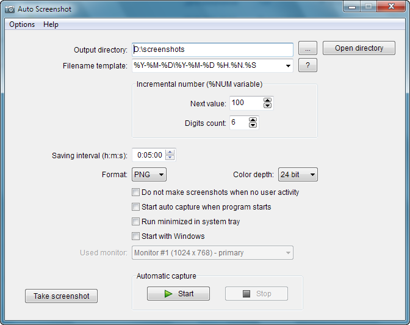

[ ru](README-ru.md "Russian")

-------------------------  

Auto Screenshot
===============

&nbsp;&nbsp;&nbsp;&nbsp;&nbsp;&nbsp;&nbsp;&nbsp;&nbsp;&nbsp;&nbsp;&nbsp;

This tool takes capture of the screen every X minutes.

## Screenshots

## Localization
* English
* Russian

## Download
You can download build for Windows from release page: [https://github.com/artem78/AutoScreenshot/releases](https://github.com/artem78/AutoScreenshot/releases)

## License
GNU General Public License v3.0

## Author
Artem78
